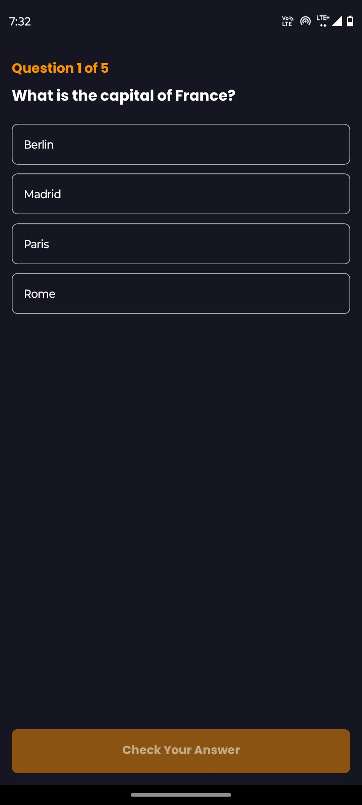
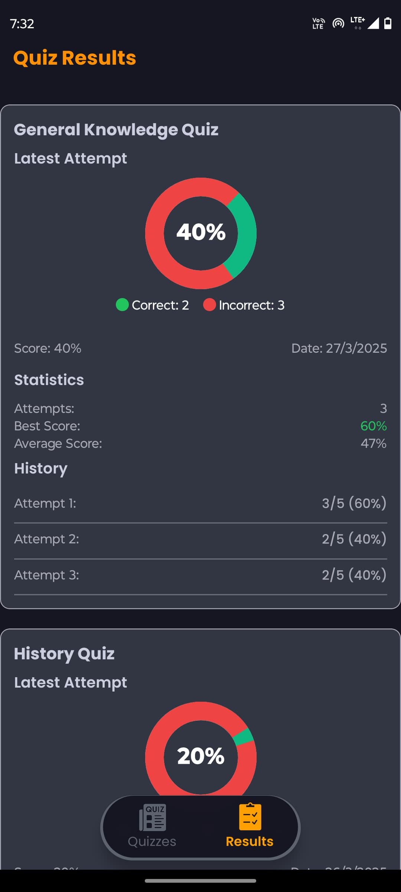

# Quiz Master - Mobile Quiz Application
## App Builds

You can access the latest build of Quiz Master through Expo:

[](https://expo.dev/accounts/bharathkumarreddy2004/projects/quizmaster/builds/696f704b-9f0f-4333-a0d3-83677ffbf6f7)

## App Screenshots

<div align="center" style="display: flex; flex-wrap: wrap; justify-content: center; gap: 16px;">
  
  
  
  
  
  
</div>

## Table of Contents
- [Features](#features)
- [Technologies Used](#technologies-used)
- [Installation](#installation)
- [Running the App](#running-the-app)
- [Building the App](#building-the-app)

## Features

✅ **Quiz Selection Screen**  
- List of available quizzes
- Quiz details (title, number of questions)

✅ **Interactive Quiz Experience**  
- Single-choice question format
- Visual feedback for selected answers
- Immediate validation on submission
- Score tracking throughout the quiz

✅ **Results Screen**  
- Detailed performance summary
- Correct/incorrect answer breakdown
- Score percentage calculation

✅ **Bonus Features**  
- Back button prevention during active quiz
- Persistent quiz history using Zustand
- Responsive design with Tailwind CSS

## Technologies Used

- **Framework**: React Native (Expo)
- **Language**: TypeScript
- **Styling**: Tailwind CSS
- **State Management**: Zustand
- **Navigation**: Expo Router
- **Build Tool**: EAS Build

## Installation

1. Clone the repository:
   ```bash
   git clone https://github.com/BHARATHKUMARREDDY2004/Quiz-Master/
   cd Quiz-Master
   ```

2. Install dependencies:
   ```bash
   npm install
   # or
   yarn install
   ```

3. Set up EAS CLI (for building):
   ```bash
   npm install -g eas-cli
   eas login
   ```

## Running the App

### Development Mode
```bash
npm start
# or
yarn start
```

### Android Emulator
```bash
npm run android
# or
yarn android
```

### iOS Simulator (macOS only)
```bash
npm run ios
# or
yarn ios
```

## Building the App

### Android Preview Build
```bash
eas build -p android --profile preview
```

### Production Build
```bash
eas build -p android --profile production
```

**Developed by [Bharath Kumar Reddy]**  
[](https://github.com/BHARATHKUMARREDDY2004/)
[](https://www.linkedin.com/in/bharath-kumar-reddy-vemireddy/)
